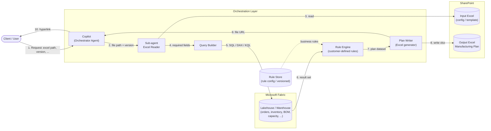
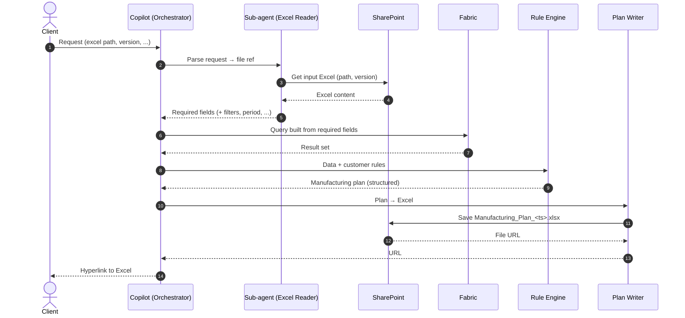

# Manufacturing Plan – Data Architecture

## 1. Kiến trúc tổng thể

## 2. Sequence

## 3. Thành phần & dữ liệu

| # | Thành phần | Input | Output | Ghi chú |
|---|-----------|-------|--------|---------|
| 1 | Copilot (orchestrator) | Query từ client | Điều phối các bước, trả hyperlink | Giữ context/run-id |
| 2 | Sub-agent Excel Reader | path, version | Required fields (JSON) | Dùng Graph API / SharePoint connector |
| 3 | Query Builder | Required fields | Câu query Fabric (parameterized) | Chỉ sinh query từ whitelist field/bảng |
| 4 | Fabric | Query | Result set | Lakehouse/Warehouse SQL endpoint |
| 5 | Rule Engine | Result set + rules | Manufacturing plan | Rules versioned, tách khỏi code |
| 6 | Plan Writer | Plan | Excel trên SharePoint + URL | Tên file có timestamp/version |

## 4. Điểm cần chốt với khách

- Cấu trúc Excel đầu vào: field nào là "required field", version xác định thế nào.
- Rule-logic của khách: dạng nào (Excel/JSON/code), ai sở hữu, versioning.
- Auth: Entra ID / managed identity cho Fabric & SharePoint; phân quyền theo user.
- Output: ghi đè hay tạo file mới mỗi lần; quyền truy cập link.
- Lỗi/audit: log run-id, input version, query, rule version để truy vết.
